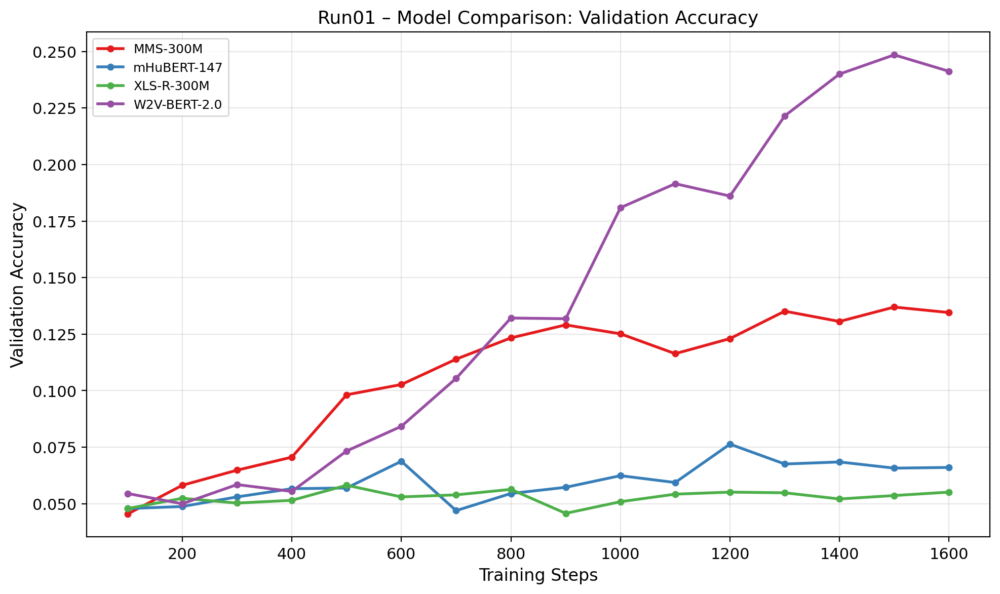
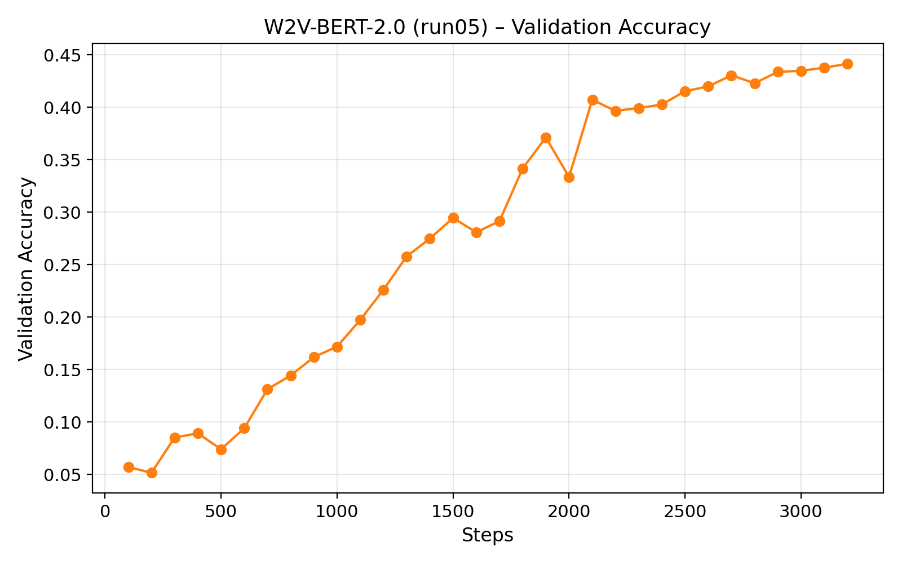
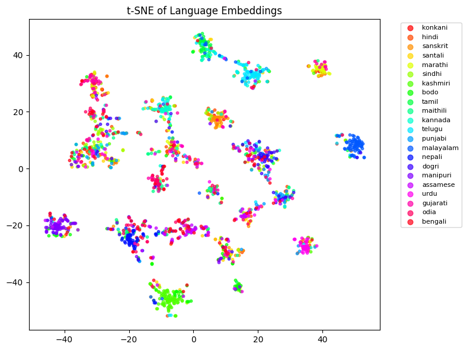
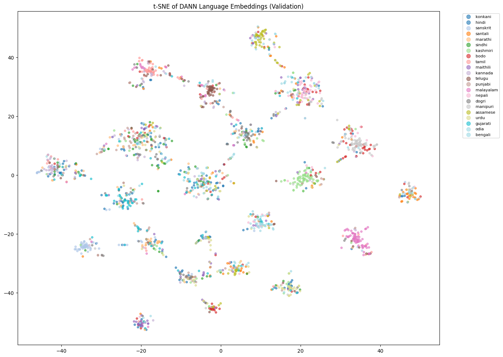
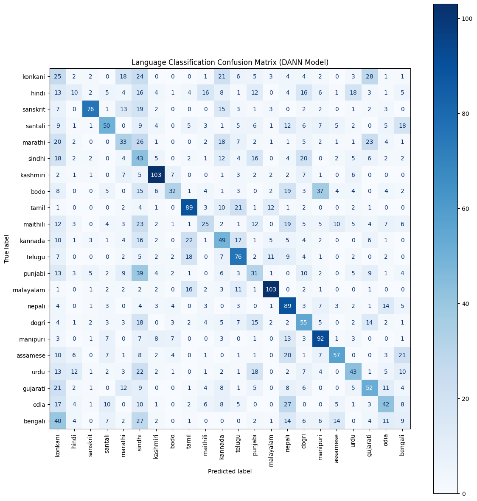

# Speech Language Identification with Transformer Models

## Overview

This project implements a **spoken language identification (SLID)** system for **22 Indian languages** using pretrained speech transformer models.

The goal of this project is to:

* improve classification performance through fine-tuning
* analyze and mitigate **speaker bias**
* understand learned representations using visualization techniques

The system is based on **W2V-BERT 2.0** and trained on the `badrex/nnti-dataset-full` dataset from Hugging Face.

---

## Key Results

* Best model: **W2V-BERT 2.0**
* Final validation accuracy: **44.15%**
* DANN reduced speaker bias but lowered accuracy (~35%)
* Data augmentation made convergence harder (~25%)

This demonstrates an important trade-off between:

* **high accuracy**
* **robust, bias-reduced representations**

---

## Model Comparison



Among multiple pretrained speech models, **W2V-BERT 2.0** achieved the best performance.

---

## Training Progress



Careful hyperparameter tuning (learning rate, warmup, batch size) significantly improved performance.

---

## Bias Analysis with t-SNE

### Before Debiasing



The embeddings show clustering influenced by **speaker identity**, indicating bias in the model.

### After DANN



DANN reduces speaker-specific structure, encouraging **speaker-invariant language representations**.

---

## Evaluation



The confusion matrix shows class-level performance and highlights challenging language distinctions.

---

## Approach

The project consists of three main components:

### 1. Baseline Improvement

* Fine-tuning pretrained speech transformer models
* Hyperparameter optimization (learning rate, warmup, batch size, epochs)

### 2. Bias Mitigation

* Domain-Adversarial Neural Networks (DANN)
* Speed perturbation augmentation

### 3. Analysis

* t-SNE visualization of embeddings
* Confusion matrix evaluation
* Model comparison experiments

---

## Project Structure

```
speech-language-identification/
├── train_model.py
├── src/
│   ├── data.py
│   ├── model.py
│   ├── dann.py
│   ├── augmentation.py
│   └── utils.py
├── scripts/
│   ├── make_plots.py
│   ├── plot_model_comparison.py
│   ├── make_tsne.py
│   └── make_confusion_matrix.py
├── figures/
├── report/
└── requirements.txt
```

---

## Requirements

* Python ≥ 3.9
* PyTorch
* HuggingFace Transformers
* librosa
* matplotlib

Install dependencies:

```bash
pip install -r requirements.txt
```

---

## Training

### Standard Fine-Tuning

```bash
python train_model.py --mode standard
```

### DANN Training

```bash
python train_model.py --mode dann
```

### DANN + Augmentation

```bash
python train_model.py --mode dann_aug
```

---

## Notes

* Dataset is loaded automatically from Hugging Face
* Audio is resampled to 16 kHz
* Small dataset size introduces strong speaker bias
* Debiasing remains challenging in low-speaker scenarios

---

## Author

Kamyar Kashezand
MSc Bioinformatics – Saarland University
